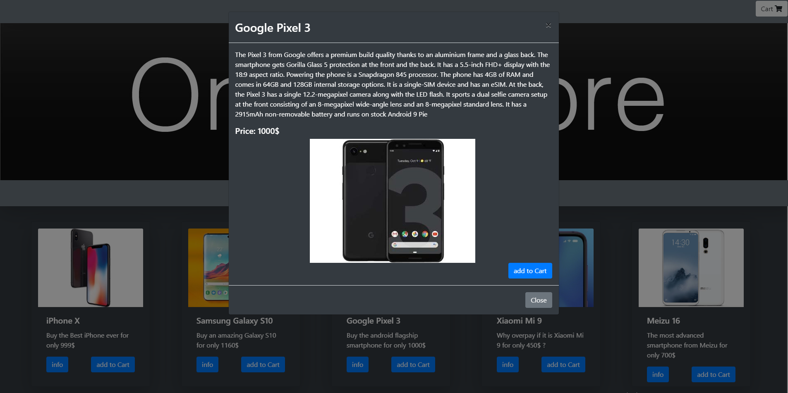

# Online-Store

made by Nick Shpilevsky

A coursework. Created Online Store using **jQuery Bootstrap libraries, AJAX Requests, simple back-end**.
You can read information about every product, add them to the cart and make an order. Information that you write in inputs is displayed on a terminal.
# Usage
1. ``` npm i ```
2. ```cd Back-end```
3. ```node back.js```
4. Open index.html

# Demo
  

  

  


